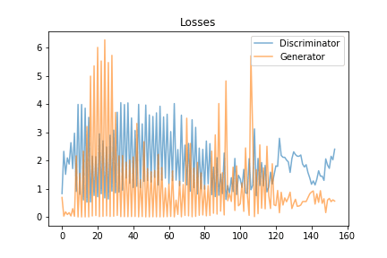
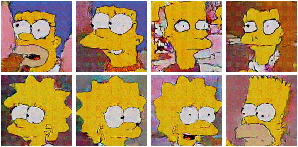
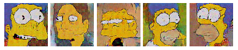

# DCGAN_Simpsons_Faces_Tensorflow2
DCGAN Simpsons Faces Image Generator usging Tensorflow2 Alpha 🖼️.

# Reimplemented Image Generator as Tensorflow2
 
Reimplemented [Greg](https://github.com/gsurma)'s image generator as tensorflow2-alpha.  
[Greg](https://github.com/gsurma)'s image generator can be found [here](https://github.com/gsurma/image_generator).  
The reimplementation used [Greg](https://github.com/gsurma)'s hyperparameters and datasets.  

<h3 align="left">
  
</h3>
 
# Simpsons Faces Image Generator

Python notebook containing TensorFlow2 DCGAN implementation. 
The data was downloaded as described by Greg. 
It was trained on a [Simpsons Faces](https://www.kaggle.com/kostastokis/simpsons-faces) dataset.

 

I applied the list of image files that [Greg](https://github.com/gsurma) excluded. ( simpsons_dataset.txt )

 

Check out corresponding Kaggle kernel: [Image Generator](https://www.kaggle.com/greg115/image-generator-dcgan-the-simpsons-dataset).

Greg result :

<h3 align="left">
  
  
</h3>

## DCGAN Infomation
Network architecture by [Radford et al., 2015](https://arxiv.org/abs/1511.06434).

## Training Data

The hyperparameteres applied by Greg were used.
Visualization of training with the following hyperparameteres.

<h3 align="left">
  
  
  
</h3>

	IMAGE_SIZE = 128
	NOISE_SIZE = 100
	LR_D = 0.00004
	LR_G = 0.0004
	BATCH_SIZE = 64
	EPOCHS = 300
	BETA1 = 0.5
	WEIGHT_INIT_STDDEV = 0.02
	EPSILON = 0.00005

## Results

Selected Samples

 
I also had some funny-looking malformed faces as well

## Author

**JiamSeo (jams777) Donny** 

[**GITHUB**](https://github.com/jams777)
